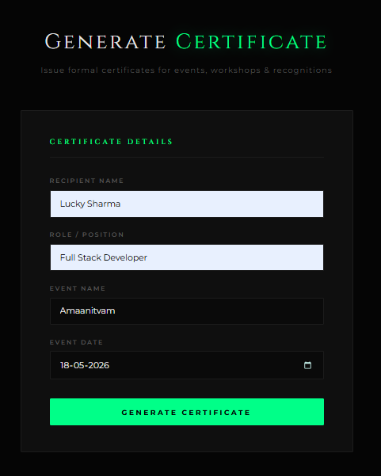
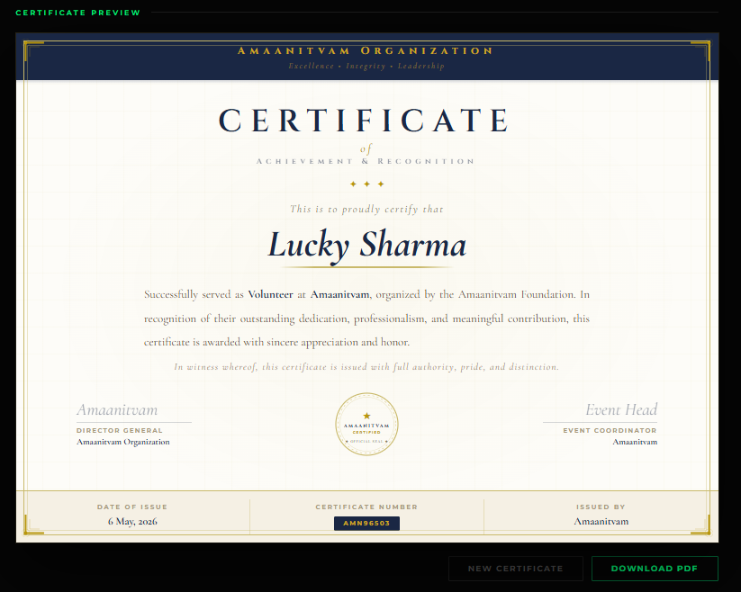
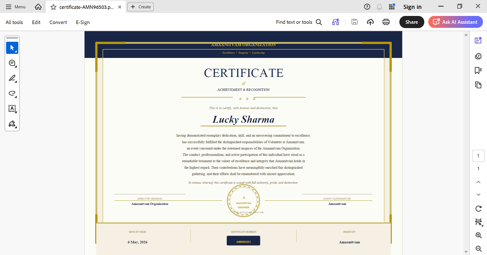
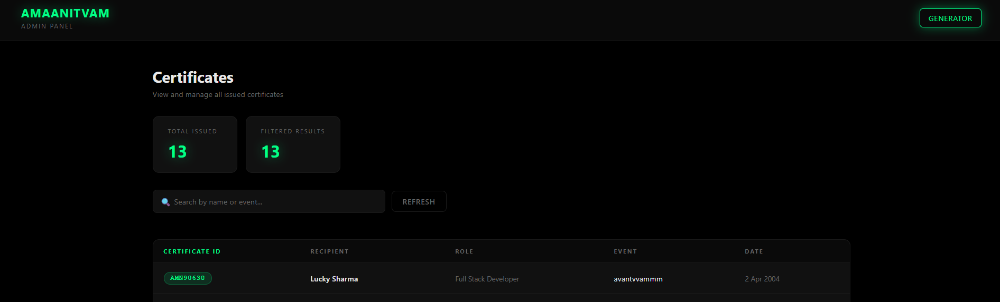

# 🚀 Amaanitvam Certificate Generator  
### ⚡ Production-Ready Certificate Automation System

A fully functional, real-world web application built to **automate certificate generation at scale** with a premium UI and instant PDF export.

> Designed with a product mindset — not just a college project.

---

## 🎯 Why This Project Stands Out

- ✅ Solves a **real-world problem** (manual certificate generation)
- ✅ Built with **scalable architecture (API-ready)**
- ✅ Focus on **UI/UX + performance**
- ✅ Generates **production-quality PDFs**
- ✅ Can be directly used by **colleges, NGOs, events**

---

## ✨ Core Features

- 🎓 **Dynamic Certificate Generation**
  - User inputs → instant certificate preview

- 📄 **High-Quality PDF Export**
  - A4 Landscape
  - Professional typography & layout

- 🆔 **Unique Certificate ID**
  - Enables tracking & future verification system

- ⚡ **Real-Time Rendering**
  - No reloads, smooth UX

- 🎨 **Premium Design System**
  - Dark Neon Admin UI  
  - Formal White-Gold Certificate UI  

---

## 🛠️ Tech Stack

**Frontend**
- HTML5
- CSS3 (Custom Design System)
- JavaScript (Vanilla)

**Library**
- jsPDF (PDF generation engine)

**Backend (API-ready design)**
- Node.js + Express (extendable)

---

## ⚙️ System Architecture

- Clean separation between **UI and backend**
- Easily integratable with database (MongoDB / SQL)

---

## 📸 Key Highlights

- Pixel-perfect certificate design  
- Structured layout with watermark, seal, signatures  
- Fully responsive interface  
- Lightweight & fast  

---

## 🔌 API Design

### Request
```json
{
  "name": "Lucky Sharma",
  "role": "Participant",
  "event": "Hackathon 2026",
  "date": "2026-05-05"
}

{
  "name": "Lucky Sharma",
  "role": "Participant",
  "event": "Hackathon 2026",
  "date": "2026-05-05",
  "id": "CERT-X9A2K1"
}

🚀 Setup Instructions

1. Clone Repository
git clone https://github.com/luckysharma06102004-stack/certificate-generator.git
cd certificate-generator

2. Run Frontend

index.html

3. (Optional) Run Backend

npm install express
node server.js

🧠 Engineering Decisions

- Used Vanilla JS → better understanding of core concepts
- Designed custom UI system instead of templates
- Optimized PDF rendering for clarity + alignment
- Structured for future scalability


🔮 Future Scope


🔐 Certificate verification system

📊 Admin dashboard (history tracking)
📧 Email automation
☁️ Cloud deployment (Vercel + Render)
🗄️ Database integration


💼 What This Project Demonstrates
Strong frontend fundamentals
Ability to build real-world usable systems
Understanding of API-based architecture
Focus on clean UI/UX
Problem-solving beyond basic assignments

---

## 📸 Screenshots

### 🧑‍💻 User Interface


### 🏆 Certificate Preview


### 📄 PDF Output


### ⚙️ Admin Panel


---
 


👨‍💻 Author
Lucky Sharma
Engineering Student | Aspiring Software Developer

📌 Final Note
This project reflects my approach to development:

Build things that are actually useful, scalable, and production-ready.

